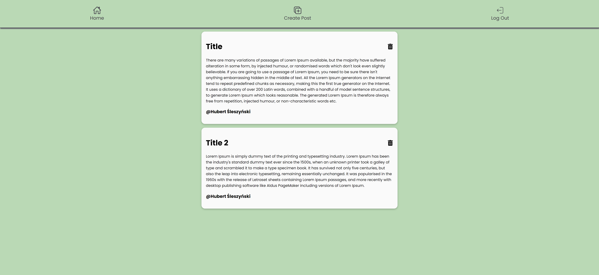

# InspiraNota

This blog/to-do-list application is a tool designed for efficient task management. With its dynamic user interface, you can easily add and remove your posts. By using Firebase database your posts are stored in the cloud which makes it more secuire. Is it possible to complete a portfolio without this?

## Demo

LIVE: [InspiraNota](https://blog-website-69054.web.app/)

## Screenshot

## Tech Stack

Yarn Vite React CSS Firebase

## Author

### Hubert Śleszyński

Portfolio: https://hrs-dev.netlify.app/

Linkedin: https://www.linkedin.com/in/hubertsleszynski/

Github: https://github.com/HubertSleszynski
